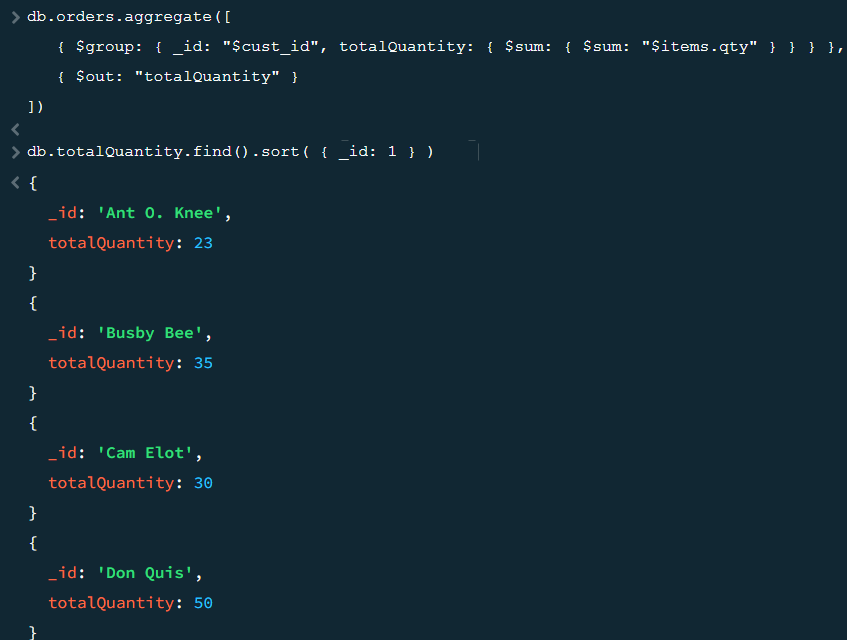

* I had no problems during installation of mongodb.
* insertMany screenshot:

* Query screenshot:
  
* replaceOne screenshot:
  
* Delete screenshot:
  
* bulkWrite screenshot:
  
* TotalPricePerCostumer screenshot:
  
* groupByItem screenshot:
  
* totalQuantityPerCostumer screenshot:
  
* the Map-reduce function i made gives back the total quantity of items a costumer has purchased. It can be used to see which costumer has purchased the most items.

